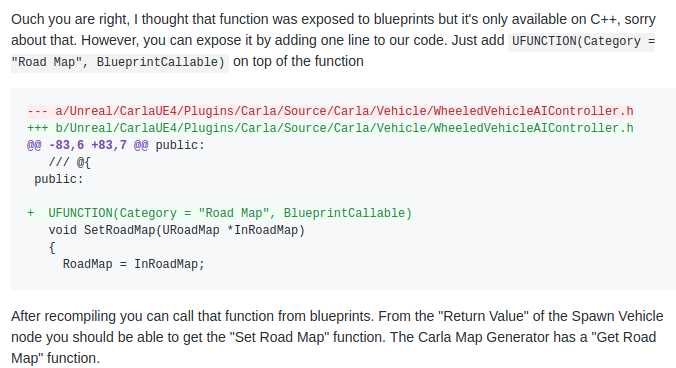

If you don't have Carla installed or if you can't find the folders below (probably because you have the compiled version)
Please follow the instructions on this link:
https://carla.readthedocs.io/en/stable/how_to_build_on_linux/

Please download the entire folder and copy paste into carla/Unreal/CarlaUE4/Content/Maps

For the scenarios in the folder extra_instructions_needed. Please do the following before running.

Note use ./Rebuild.sh to recompile
